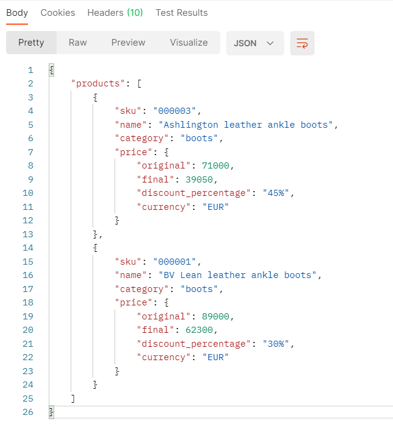

---------------------
MYT-coding-challenge
====================

* [Getting started](#getting-started)
  * [Installation](#installation)
* [Code overview](#code-overview)
  * [Dependencies](#dependencies) 
  * [Folders](#folders)
  * [Environment variables](#environment-variables)
* [API](#api)
  * [Request headers](#request-headers)
  * [Request sample](#request-sample)
  * [Response sample](#response-sample)
* [Testing](#testing)
* [Release notes](#release-notes)
* [Explanations on decisions taken](#explanations-on-decisions-taken)
* [License](#license)

----------

# Getting started

## Installation

Please check the official laravel installation guide for server requirements before you start. [Official Documentation](https://laravel.com/docs/8.x/installation)

Clone the repository

    git clone git@github.com:YRSLV/MYT-coding-challenge.git

Switch to the repo folder

    cd MYT-coding-challenge

Install all the dependencies using composer

    composer install

Copy the example env file and make the required configuration changes in the .env file

    cp .env.example .env

Generate a new application key

    php artisan key:generate

This project uses Amazon DynamoDB, however you will still need to create MySQL database for the project (the default DB name would be 'myt_coding_challenge'), otherwise you won't be able to run migrations. The reason for this strange behaviour can be found in one of the [issue comments](https://github.com/baopham/laravel-dynamodb/issues/90#issuecomment-447594258) in the discussionson on baopham/laravel-dynamodb GitHub repository. "...As of this writing, the latest version of Laravel is 5.7. It wants to write to the migrations mysql table, even after commenting out any existing migrations bundled with Laravel". The same is true for Laravel 8.34.0.

Next, you will need to deploy a local downloadable version of Amazon DynamoDB. The first option involves using an executable .jar file, though other options are available. Please refer to [Amazon Developer Guide](https://docs.aws.amazon.com/amazondynamodb/latest/developerguide/DynamoDBLocal.DownloadingAndRunning.html) for more info and installation manuals. To manage DynamoDB tables via GUI application you can use [Amazon NoSQL Workbench](https://docs.aws.amazon.com/amazondynamodb/latest/developerguide/workbench.html). Another option would be [dynamodb-admin](https://github.com/aaronshaf/dynamodb-admin), but [NoSQL Workbench]((https://docs.aws.amazon.com/amazondynamodb/latest/developerguide/workbench.html)) is way more robust and provides data modeling, data visualization, and query development features.

Now you will need to start DynamoDB local server. For Windows executable .jar file version you will need to navigate to the directory where you extracted DynamoDBLocal.jar, and enter the following command

    java -D"java.library.path=./DynamoDBLocal_lib" -jar DynamoDBLocal.jar -port 8001 -sharedDb

(**Now set the database connection values in .env before migrating**)

Run the database migrations 

    php artisan migrate

(Optional) Populate db with products data

    php database/data_loaders/loadProductsData.php

(Optional) Populate db with discounts data

    php database/data_loaders/loadDiscountsData.php

Start the local development server 

    php artisan serve

***Note*** : If you configured your DynamoDB local server to run on default port (which is 8000), the local development server will fail to listen on http://localhost:8000 and will eventually start on http://localhost:8001.

You can now access the server at http://localhost:8000

**TL;DR command list**

    git clone git@github.com:YRSLV/MYT-coding-challenge.git
    cd MYT-coding-challenge
    composer install
    cp .env.example .env
    php artisan key:generate 

**Optional**

    php database/data_loaders/loadProductsData.php
    php database/data_loaders/loadDiscountsData.php
    
**Make sure you set the correct database connection information before running the migrations and started DynamoDB local server** [Environment variables](#environment-variables)

    php artisan migrate
    php artisan serve
    
From now on, the project is runnable with 1 simple command `php artisan serve` from any machine 🙂 (assuming of course that all prerequisites are met and all the necessary services are already started).

----------

# Code overview

## Dependencies

- [baopham/laravel-dynamodb](https://github.com/baopham/laravel-dynamodb) - DynamoDB integration package. Extends the model with BaoPham\DynamoDb\DynamoDbModel, then you can use Eloquent methods that are supported. The idea here is that you can switch back to Eloquent without changing your queries. 

## Folders

- `app/Models` - Contains all the Eloquent models
- `app/Http/Controllers/Api/V1` - Contains all the api controllers
- `app/Http/Middleware` - Contains all the middleware
- `config` - Contains all the application configuration files
- `database/migrations` - Contains all the database migrations, both standard SQL and newly added DynamoDB migrations
- `routes` - Contains all the api routes defined in api.php file
- `tests` - Contains all the application tests

## Environment variables

- `.env` - Environment variables can be set in this file

You will need to set some DynamoDB variables either in .env or in config/dynamodb.php
If you decide to set these variables in .env, the list should look similar to this:

    AWS_ACCESS_KEY_ID=fakeMyKeyId
    AWS_SECRET_ACCESS_KEY=fakeSecretAccessKey
    AWS_DEFAULT_REGION=eu-central-1
    AWS_BUCKET=

    DYNAMODB_CONNECTION=local
    DYNAMODB_LOCAL_ENDPOINT= http://localhost:8001

----------

# API

Run the laravel development server

    php artisan serve

The api can now be accessed at

    http://localhost:8000/api/v1/products

## Request headers

| **Required** 	| **Key**              	| **Value**            	|
|----------	|------------------	|------------------	|
| Yes      	| Accept     	| application/json 	|

* Requests can be filtered by category and by priceLessThan as a query string parameters, the priceLessThan filter applies before
discounts are applied and will show products with prices lesser than or equal to the value provided.
* Returns at most 5 elements.

## Request sample

    http://localhost:8000/api/v1/products?category=boots&priceLessThan=90000

## Response sample

----------

# Testing

Tests are runnable with 1 command 🙂 (assuming of course that all prerequisites are met and all the necessary services are already started).

You may run application tests using phpunit:

    ./vendor/bin/phpunit

In addition to the phpunit command, you may use the test Artisan command to run the tests. The Artisan test runner provides verbose test reports in order to ease development and debugging:

    php artisan test

For more information regarding tests, please refer to [EXPLANATIONS](./docs/EXPLANATIONS.md).

----------

# Release notes

Version 0.1.0 brings REST API endpoint complete implementation.

Version 0.2.0 adds implementation for querying the Global Secondary Index and populating DB with products and discounts data.

Version 0.3.0 adds tests for API endpoint functionality and some small performance improvements.

Version 0.4.0 adds additional documentation with explanations on decisions taken.

----------

# Explanations on decisions taken

See [EXPLANATIONS](./docs/EXPLANATIONS.md)

__________

# License

See [LICENSE](./LICENSE.md)
